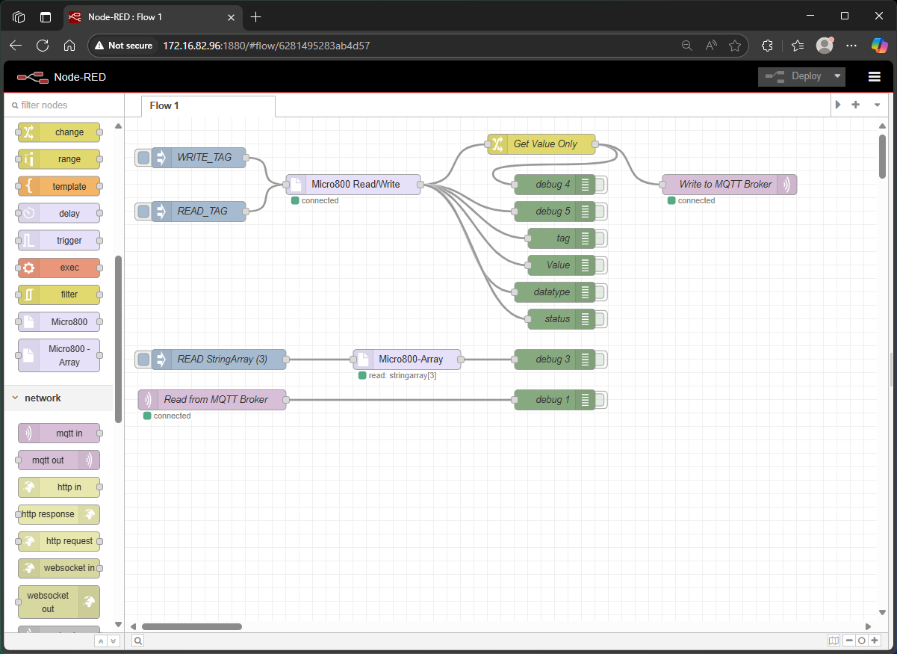

# node-red-contrib-micro800plc

A Node-RED custom node package for connecting to Allen-Bradley Micro800 PLCs using Node-Logix. This package provides two nodes: **Micro800** (for single tag read/write) and **Micro800-Array** (for array tag read/write), making it easy to integrate your PLCs with Node-RED flows.

---

## Features
- Configure PLC connection parameters
- Read and write single tags or arrays of tags on Allen-Bradley Micro800 PLCs
- Supports both simple and advanced use cases
- Built on top of the [Node-Logix](https://www.npmjs.com/package/node-logix) library

---

## Nodes

### Micro800
Read or write a single tag on a Micro800 PLC.

**Configuration:**
- **Host IP**: The IP address of the PLC
- **Read Tag**: The tag to read
- **Write Tag**: The tag to write
- **Write Value**: The value to write (for write action)
- **Action**: Choose "Read" or "Write"

**Input Message Format:**
- To override configuration, set properties in `msg.payload`:
  - `action`: "read" or "write"
  - `tag`: Tag to use (overrides configured tag)
  - `value`: Value to write (for write action)

**Examples:**
```json
{
  "payload": {
    "action": "read",
    "tag": "MyTag"
  }
}
```
```json
{
  "payload": {
    "action": "write",
    "tag": "MyTag",
    "value": 123
  }
}
```

---

### Micro800-Array
Read or write an array tag on a Micro800 PLC.

**Configuration:**
- **Host IP**: The IP address of the PLC
- **Array Tag**: The name of the array tag (e.g., `MyArrayTag`)
- **Data Type**: The data type of the array elements (DINT, INT, REAL, BOOL, etc.)
- **Array Length**: Number of elements to read or write
- **Action**: Choose "Read" or "Write"
- **Write Value**: The array of values to write (for write action)

**Input Message Format:**
- To override configuration, set properties in `msg.payload`:
  - `action`: "read" or "write"
  - `arrayTag`: Tag to use (overrides configured tag)
  - `dataType`: Data type (overrides configured type)
  - `length`: Number of elements (overrides configured length)
  - `writeValue`: Array of values to write (for write action)

**Examples:**
_Read 5 elements from an array:_
```json
{
  "payload": {
    "action": "read",
    "arrayTag": "MyArrayTag",
    "dataType": "DINT",
    "length": 5
  }
}
```
_Write an array to the PLC:_
```json
{
  "payload": {
    "action": "write",
    "arrayTag": "MyArrayTag",
    "dataType": "DINT",
    "length": 3,
    "writeValue": [10, 20, 30]
  }
}
```

...


...


...


...

---




---

## Installation
1. Install this node in your Node-RED user directory:
   ```sh
   npm install node-red-contrib-micro800plc
   ```
2. Restart Node-RED.
3. Drag the `Micro800` or `Micro800-Array` node into your flow.
4. Configure the PLC connection and tag parameters in the node properties.

---

## Output
Both nodes output a message with the following structure in `msg.payload`:
- `tag` or `arrayTag`: The tag name used
- `value`: The value(s) read or written
- `dataType`: The data type used
- `status`: Operation status (e.g., `read-success`, `write-success`)

---

## License
MIT
